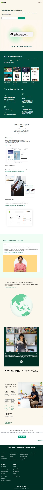

# SHOPIFY-WEBSITE-CLONE

## About

This is shopify.in website clone build using Html and Tailwind Css. I have used flex-box and gird to make this website. I really enjoyed creating this project. My aim is to make this website exect like the original shopify.in website. Hope i have made it like the shopify.in website.

## ⚙️ What did I learn by making this project?

-   learn to add custom font in TailwindCss.
-   learn using custom colors in TailwindCss.

## ⌛ Time taken to finish this project?

This project took me around 9 hour to finish.

## 📷 Screenshots

